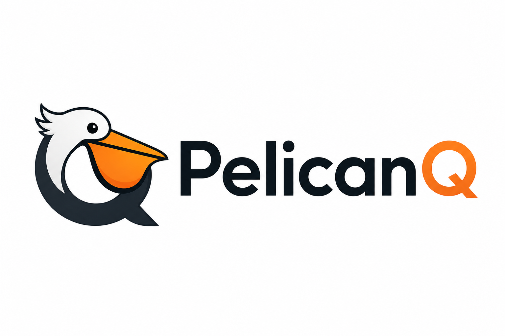

<p align="center">
  
</p>

<h1 align="center">PelicanQ</h1>

<p align="center">
  <em>A distributed, crash-safe message queue built in Rust</em>
</p>

<p align="center">
  <a href="https://github.com/Open-Collective-Labs/PelicanQ/blob/main/LICENSE">
    
  </a>
  <a href="https://github.com/Open-Collective-Labs/PelicanQ">
    
  </a>
  <a href="https://github.com/Open-Collective-Labs/PelicanQ/actions">
    
  </a>
  
  
</p>

<p align="center">
  <a href="#quick-start">Quick Start</a> •
  <a href="#features">Features</a> •
  <a href="#sdks">SDKs</a> •
  <a href="#documentation">Docs</a> •
  <a href="#contributing">Contributing</a>
</p>

---

PelicanQ provides at-least-once delivery with FIFO ordering, embedded sled persistence, dual-protocol access (HTTP + gRPC + MQTT), and Raft-based clustering for high availability.

## Quick Start

```bash
# Build the workspace
cargo build

# Run the daemon (Solo mode)
PELICANQ_DATA_DIR=./data cargo run --bin pelicanqd

# Use the Rust SDK example:
cargo run -p rust-publish-consume -- http://127.0.0.1:7072

# Or use the HTTP API directly:
curl -X POST http://127.0.0.1:7070/queues/myqueue
curl -X POST http://127.0.0.1:7070/queues/myqueue/publish \
  -H 'content-type: application/json' \
  -d '{"payload_base64":"SGVsbG8=","headers":{}}'
curl -X POST http://127.0.0.1:7070/queues/myqueue/consume
```

## Features

| Category | Features |
|----------|----------|
| **Core** | FIFO queues, priority (0-9), at-least-once delivery, ack/nack, batch operations |
| **Persistence** | Embedded sled storage, crash recovery, TTL/retention policies, storage watermarks |
| **Reliability** | Dead-letter queues, message deduplication, delayed/scheduled messages |
| **Protocols** | HTTP/REST, gRPC (including streaming consume), MQTT 3.1.1 |
| **Clustering** | Raft consensus (openraft), leader election, failover, snapshot/restore |

## SDKs

| Language | Package | Version | Status |
|----------|---------|---------|--------|
| **Rust** | [`pelicanq`](sdks/rust/) | `0.1.0` | Reference |
| **Go** | [`pelicanq`](sdks/go/) | `v0.1.0` | Stable |
| **Python** | [`pelicanq`](sdks/python/) | `0.1.0` | Stable |
| **Node.js** | [`pelicanq`](sdks/node/) | `0.1.0` | Stable |
| **Java** | [`pelicanq-client`](sdks/java/) | `0.1.0` | Stable |

## Documentation

| Section | Contents |
|---------|----------|
| [Getting Started](docs/getting-started/quickstart.md) | Quickstart, installation, configuration |
| [Guides](docs/guides/publish-consume.md) | Publish/consume, batches, scheduling, priorities, dedup, DLQ, MQTT |
| [Architecture](docs/architecture/overview.md) | System design, storage model, delivery semantics, retention, clustering |
| [Deployment](docs/deployment/solo.md) | Solo mode, Flock cluster, configuration reference |
| [Reference](docs/reference/http-api.md) | HTTP API, gRPC API, proto spec, SDK docs |
| [Development](docs/development/building.md) | Building from source, testing, contributing |
| [Roadmap](docs/roadmap.md) | Completed, in-progress, and planned features |
| [Features & Spec](FEATURES.md) | Full feature specification with status |

## Maintain

```bash
# Run all tests
cargo test --workspace

# Build in release mode
cargo build --release

# Check formatting
cargo fmt --check

# Lint
cargo clippy --all-targets
```

## Contributing

We welcome contributions! See the [Contributing Guide](CONTRIBUTING.md) to get started.

Small iterative PRs are preferred over large sweeping changes.

## License

MIT

---

[Changelog](CHANGELOG.md) — [Contributing](CONTRIBUTING.md) — [Code of Conduct](CODE_OF_CONDUCT.md) — [Security](SECURITY.md)
